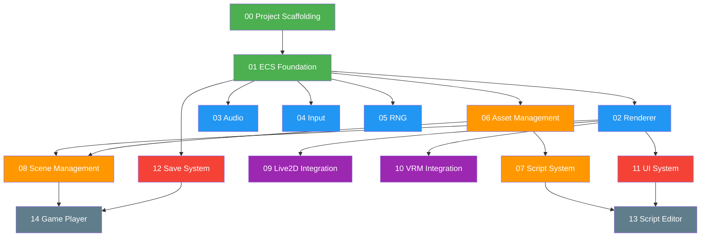

# 📋 実装プラン全体概要

本ドキュメントは `rs-game-dev` ゲームエンジンの機能別実装プランの全体像を示す。

## フェーズ構成と依存関係

## プラン一覧

| Phase | # | プラン名 | 依存先 | 推定規模 |
|-------|---|----------|--------|----------|
| **0** | [00](./00_project_scaffolding.md) | Project Scaffolding | なし | S |
| **0** | [01](./01_ecs_foundation.md) | ECS Foundation | 00 | M |
| **1** | [02](./02_renderer.md) | Renderer (Filament) | 01 | XL |
| **1** | [03](./03_audio.md) | Audio System | 01 | M |
| **1** | [04](./04_input.md) | Input Abstraction | 01 | S |
| **1** | [05](./05_rng.md) | Dual RNG | 01 | S |
| **2** | [06](./06_asset_management.md) | Asset Management | 01 | L |
| **2** | [07](./07_script_system.md) | Script System | 06 | L |
| **2** | [08](./08_scene_management.md) | Scene Management | 02, 06 | M |
| **3** | [09](./09_live2d_integration.md) | Live2D Integration | 02 | XL |
| **3** | [10](./10_vrm_integration.md) | VRM/FBX Integration | 02 | XL |
| **4** | [11](./11_ui_system.md) | UI System (MVVM) | 02 | XL |
| **4** | [12](./12_save_system.md) | Save System | 01 | M |
| **5** | [13](./13_script_editor.md) | Script Editor | 07, 11 | XL |
| **5** | [14](./14_game_player.md) | Game Player | 08, 12 | M |
| **X** | [15](./15_phase2_readiness_plan.md) | Phase 2 Readiness Plan | 02, 03, 04, 05 | M |

> **規模目安**: S=1-3日, M=3-7日, L=1-2週, XL=2-4週

## 開発方針

- Phase 0 → 1 → 2 は順次実装（基盤から積み上げ）
- Phase 1 内の 02〜05 は**並行開発可能**
- Phase 3 の Live2D/VRM は Renderer 完成後に開始
- Phase 4 の UI/Save は **並行開発可能**
- Phase 5 は全コア機能完成後に着手

## 補助プラン

- [15](./15_phase2_readiness_plan.md): Phase 2 着手前の改善項目を WBS 化した実行計画（英語版）。
